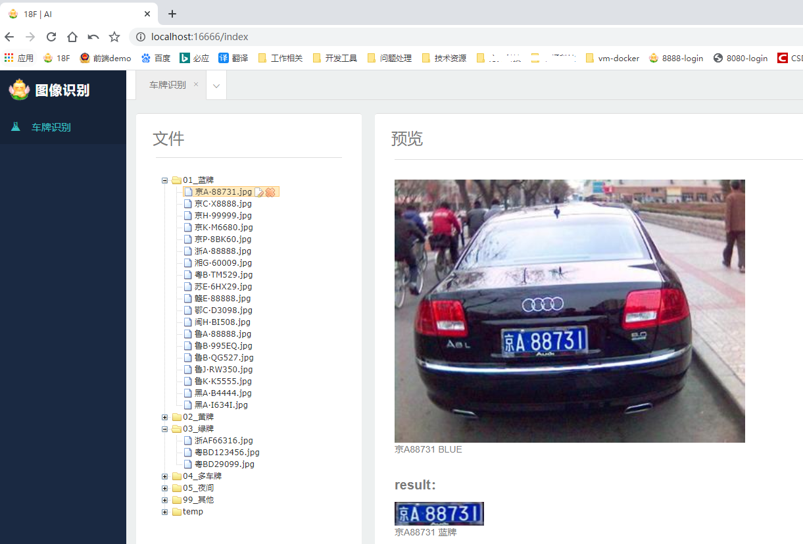
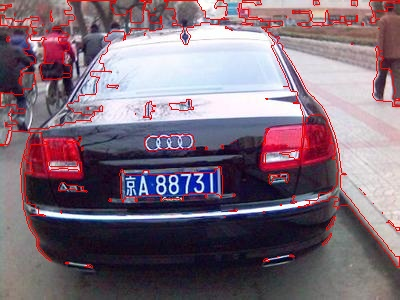

# yx-image-recognition

#### 介绍
- **spring boot + maven 实现的车牌识别及训练系统**
- 基于java语言的深度学习项目，在整个开源社区来说都相对较少；而基于java语言实现车牌识别EasyPR-Java项目，最后的更新已经是五年以前。
- **本人参考了EasyPR原版C++项目、以及fan-wenjie的EasyPR-Java项目；同时查阅了部分opencv官方4.0.1版本C++的源码，结合个人对java语言理解，整理出当前项目**
- 这是一个**入门级教程项目**，本人目前也正在学习图片识别相关技术；大牛请绕路
- 当前项目在原有EasyPR项目基础上，增加了绿牌识别功能，只不过当前的训练库文件包含绿牌的样本太少，还需要重新增加绿牌样本的训练，后续会逐步上传
- 当前已经添加基于svm算法的车牌检测训练、以及基于ann算法的车牌号码识别训练功能
- 后续会逐步加入证件识别、人脸识别等功能

#### 包含功能
- ****$\color{yellow}{黄}$** **$\color{blue}{蓝}$** **$\color{green}{绿}$**** **黄蓝绿车牌检测及车牌号码识别**
- 单张图片、多张图片并发、单图片多车牌检测及识别
- **图片车牌检测训练**
- **图片文字识别训练**
- 包含两种依赖包的实现方式： 基于org.bytedeco.javacpp包的实现方式； 基于org.opencv官方包的实现方式

#### 软件版本
- jdk 1.8.61+
- maven 3.0+
- opencv 4.0.1 ； javacpp1.4.4；opencv-platform 4.0.1-1.4.4
- spring boot 2.1.5.RELEASE
- yx-image-recognition 1.0.0版本

#### 软件架构
- B/S 架构，前端html + requireJS，后端java
- 数据库使用 sqlite3.0
- 接口文档使用swagger 2.0

#### 车牌识别流程
- **操作界面**

- **图片处理过程**

debug_GaussianBlur：

debug_gray：

debug_Sobel：

debug_threshold：

debug_morphology：

debug_Contours：

debug_result：

debug_crop：

debug_resize：

final_result:

- **图片车牌文字识别过程**

debug_char_threshold：

debug_char_clearLiuDing：

debug_specMat：

debug_chineseMat：

debug_char_auxRoi：

#### 安装教程

- 将项目拉取到本地，PlateDetect文件夹拷贝到d盘下，默认车牌识别操作均在d:/PlateDetect/目录下处理
- 需要修改操作路径，修改com/yuxue/constant/Constant.java文件常量参数即可，可以使用绝对盘符路径，也可以使用项目相对路径
- lib下依赖包添加到build path；或者修改pom文件的注释内容，将opencv-platform依赖取消注释
- spring boot方式运行项目，浏览器上输入 http://localhost:16666/index 即可打开操作界面
- 浏览器上输入 http://localhost:16666/swagger-ui.html 即可打开接口文档页面

#### 使用说明

- **车牌图片来源于网络，仅用于交流学习，不得用于商业用途；如有侵权，请联系本人删除**
- 转发请注明出处； 本项目作者：yuxue，一个不资深的java语言从业者
- 作者gitee地址: https://gitee.com/admin_yu
- 作者csdn微博地址：https://blog.csdn.net/weixin_42686388

#### 参考文档
liuruoze/EasyPR：https://gitee.com/easypr/EasyPR?_from=gitee_search
fan-wenjie/EasyPR-Java： https://github.com/fan-wenjie/EasyPR-Java
opencv官方： https://opencv.org/

